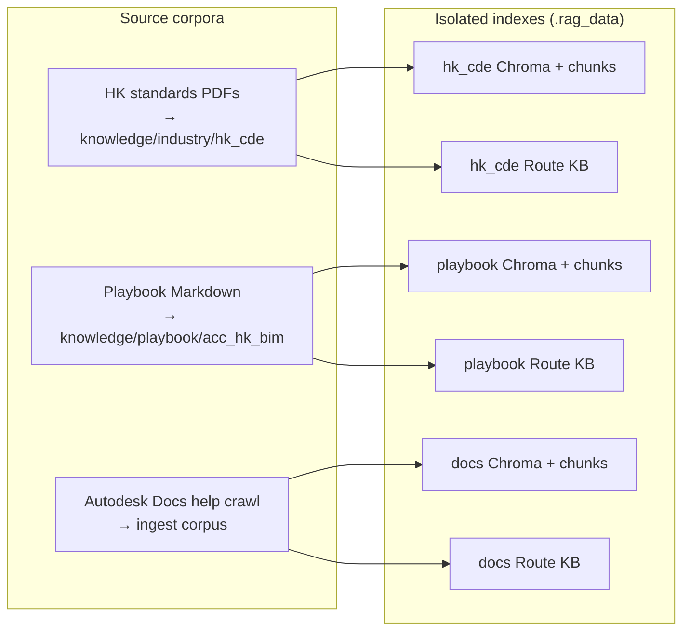
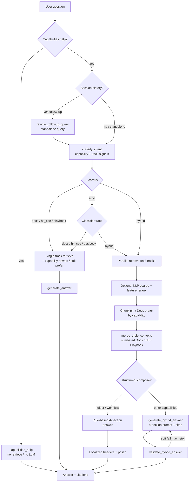

# HK BIM CDE Standard × ACC RAG

A local three-source RAG system that keeps **Hong Kong BIM / CDE standards**, an **ACC × HK implementation playbook**, and **Autodesk Docs product help** in separate indexes, then orchestrates single-track or hybrid answers by question intent.

Default CLI is `--corpus auto` (intent routing). Use `--corpus hybrid` to force all three tracks. Hybrid answers follow:

**Standards Requirements → Implementation Guidance → Product Steps → Alignment & Gaps**

## Demo

Watch a short walkthrough of the hybrid RAG in action:

https://github.com/user-attachments/assets/a55a3dec-eee8-4c38-9aef-855a1023afbc

If the player does not render in your GitHub client, open the file directly: [`assets/rag-demo.mp4`](assets/rag-demo.mp4).

## Three source RAGs

The three tracks are **physically isolated** (separate Chroma collections / chunk stores). Embeddings are never merged into one collection. Hybrid mode only combines retrieved chunks after retrieval, with numbered citations.

| Track | ID | What it covers | Corpus / index |
|-------|------|----------------|----------------|
| **1. Standards** | `hk_cde` | Hong Kong industry standards (expanded CIC BIM corpus: General, MEP, UU, Object Guide, Statutory Plans, Dictionary, AM/FM & ZCP case studies, software appendices, BD ADM-19 / ADV-34, LandsD BIM-GIS) with chapter Markdown, authority metadata and alias routing. Production ingest scope=`high`; optional shadow `substantive` | `knowledge/industry/hk_cde/` → `.rag_data/industry_hk_cde/` |
| **2. Playbook** | `playbook` | ACC × HK implementation handbook: four-container CDE, naming, permissions, approvals, design collaboration, information requirements, and ACC Project Template (GC / Buildings) guidance | `knowledge/playbook/acc_hk_bim/` → `.rag_data/playbook_acc_hk/` |
| **3. Product (Docs)** | `docs` | Autodesk Docs / ACC official help: folder organization, Naming Standard, permissions, Workflow, Project Template, Model Browser, and related product steps | crawled help → ingest → `.rag_data/` (docs main store) |

Each track also has its own **Query KB (route dictionary)**: maps colloquial / alias terms to preferred sections or URLs for pinning and query rewriting **before** vector search. Route entries themselves **do not** enter the LLM prompt.

```text
Source knowledge (Markdown / help docs)
        │
        ├─ ingest + chunk + embed ──► Chroma (content store)
        └─ build_query_kb ──────────► Route KB (routing only)
```

## System architecture

### Data plane (offline)



### Ask plane (online)

Entry point: `ask.py` / Streamlit → `HybridOrchestrator` (`rag/orchestrator/pipeline.py`).

Multi-turn (REPL / Streamlit session memory only): recent turns rewrite the
follow-up into a **standalone retrieval query**, then classify + retrieve again.
Prior answers are untrusted context for wording only — facts come from this-turn chunks.



### Multi-turn follow-ups (session memory)

Interactive CLI (`python ask.py` with no question) and Streamlit keep an in-memory `ConversationSession` (not persisted across process restarts).

| Step | Behavior |
|------|----------|
| Rewrite | Recent ≤4 turns → standalone retrieval query (`rag/orchestrator/followup.py`) |
| Retrieve | Always re-run classify + RAG this turn; prior URLs are soft hints only (no hard lock) |
| Generate | Prior answers sit in `<conversation_context_untrusted>`; **facts only from this-turn chunks** |
| Reset | CLI `/clear`; Streamlit **New conversation** |

History answers may be wrong: they resolve deixis (“那子文件夹呢？”) only and must not be cited as evidence. Eval: `python scripts/eval_conversation.py`.

### Retrieval path per track

```text
Query (capability-rewritten when available)
  → Query KB rewrite / boost (routing only)
  → Optional NLP coarse (BM25 candidate pool)
  → Vector + BM25 hybrid (RRF)
  → Optional NLP feature rerank
  → Top-K + token budget
  → Merge (hybrid) or generate (single-track)
```

### 1. Intent and meta Q&A

- **Capabilities help** (e.g. “what can you do”): returns capability text only; `track=meta`; no retrieve, no Ollama.
- **`classify_intent`**: detects a primary **capability** and track bias (`docs` / `hk_cde` / `playbook` / `hybrid`), then rewrites per-track sub-queries and drives pinning / Docs relevance filters.

Supported capabilities (single primary label; conflicts use priority order):

| Capability | Typical questions | Docs preference / pin |
|------------|-------------------|------------------------|
| `project_template` | ACC HK GC / project template | prefer `Configure_Templates_Docs` |
| `model_viewer` | Model Browser, filter RVT/IFC properties | hard pin `Model_Browser` + `Viewer_Settings_Files` |
| `permissions` | folder permissions | prefer `Folder_Permissions` |
| `naming` | naming standard / Information Container ID | Docs Naming Standard + HK / Playbook naming pins |
| `workflow` | approval workflow / Authorisation Gateway / HK-aligned workflows | prefer `Reviews_Create_Edit`; **rule compose** covers Action Upon Completion |
| `project_create` | create ACC project | prefer `Create_Project` |
| `folder` | folder structure / four CDE containers | hard pin Organize Files + Playbook WIP tree; **rule compose** |

Notes:

- Bare glossary questions like “What is WIP?” stay on `hk_cde` and **do not** trigger folder pinning or structured compose.
- Multi-signal phrases prefer the more specific capability (e.g. “folder permissions” → `permissions`, “folder naming standard” → `naming`).
- Forced `--corpus docs|hk_cde|playbook|hybrid` **keeps** the detected capability and uses its template sub-queries on that track.

### 2. Single-track vs hybrid

| `--corpus` | Behavior |
|------------|----------|
| `auto` (**default**) | Pick track from classifier (product- vs standards- vs playbook-leaning; compound → hybrid) |
| `docs` / `hk_cde` / `playbook` | Retrieve only that content store + its Query KB; still applies capability rewrite / soft Docs prefer when detected |
| `hybrid` | Force parallel 3-track retrieve → merge → 4-section answer |

### 3. Hybrid merge and answer writing

1. **Parallel retrieval**: Docs / HK CDE / Playbook each run embedding + BM25 hybrid search with capability-specific queries when available.
2. **Capability pin / prefer**:
   - Strong pins (`folder`, `naming`, `model_viewer`): swap in known good pages when retrieval drifts to overview / noise pages.
   - Soft prefer (`permissions`, `project_create`, `project_template`, `workflow`): put target Docs GUIDs first, keep normal retrieval as the second source.
   - Folder Playbook fallback only accepts explicit WIP tree evidence; otherwise it falls back to normal retrieval (no arbitrary first hit).
3. **`merge_triple_contexts`**: builds a shared numbered context list (`[1]`…) and records which track each chunk came from for later validation.
4. **Answer priority**:
   - `folder` and `workflow` use **`structured_compose`**: rule-based four sections (reduces small-model drift; workflow answers correctly describe Docs **Action Upon Completion → Copy approved files / Update attributes**).
   - Otherwise **`generate_hybrid_answer`**: enforces the four-section structure; **Route KB never enters the prompt**.
5. **Validation**: Docs capability keyword prefilter drops overview / Power BI / “What’s New” noise; soft warnings may trigger a regenerate retry. Citation ownership is enforced (Standards→HK, Implementation→Playbook, Product→Docs).
6. **Language**: section headers follow the question language (EN / zh-Hans / zh-Hant).

### 4. Optional NLP coarse filter + feature rerank

Each track’s `HybridRetriever` can run a lightweight NLP layer **before/after** the usual vector + BM25 RRF path (enabled by default via env / CLI):

| Control | Default | Meaning |
|---------|---------|---------|
| `RAG_NLP_COARSE` / `--no-nlp-coarse` | on | BM25 pool before mixing |
| `RAG_NLP_RERANK` / `--no-nlp-rerank` | on | Feature re-score after RRF |

**When it helps:** noisier / colloquial / mixed questions, where keyword expand + rerank can surface the right annex-style pages.

**When it rarely changes anything:** clean capability-pinned questions (naming / folder permissions). Capability rewrite and GUID pins already dominate ranking.

```bash
python ask.py --corpus hybrid --show-retrieval-debug "your question"
python ask.py --corpus hybrid --no-nlp-coarse --no-nlp-rerank --show-retrieval-debug "your question"
```

`ask.py` also prints token usage (`context | prompt | completion | total`) to make context-budget A/B easier.

### Four-section answer contract

| Section (EN) | Localized aliases | Primary source |
|--------------|-------------------|----------------|
| Standards Requirements | 标准要求 / 標準要求 | `hk_cde` |
| Implementation Guidance | 实施建议 / 實施建議 | `playbook` |
| Product Steps | 产品操作 / 產品操作 | `docs` |
| Alignment & Gaps | 对齐与缺口 / 對齊與缺口 | Combined (fits + remaining gaps) |

## Evaluation

Frozen baseline comparison suite: [`eval/RESULTS.md`](eval/RESULTS.md).

`scripts/eval_hybrid.py` also asserts `expect_capability` from [`eval/hybrid_cases.jsonl`](eval/hybrid_cases.jsonl). Latest hybrid orchestration run:

| Metric | Result |
|--------|--------|
| Cases | 14 |
| Intent accuracy | **100%** (14/14) |
| Capability accuracy | **100%** (14/14) |
| DualRecall (Docs+HK) | **100%** (7/7 hybrid expects) |
| TripleRecall (+Playbook) | **100%** (7/7) |
| False hybrid (pure track stolen) | **0** |

On cross-domain hybrid-expect cases, forced single-track retrieval still cannot cover more than one source family; see `eval_hybrid_vs_single.py` / `RESULTS.md`.

```bash
python scripts/run_eval_suite.py
# pieces:
python scripts/eval_query_kb.py
python scripts/eval_hk_cde.py
python scripts/eval_playbook_acc_hk.py
python scripts/eval_hybrid.py
python scripts/eval_hybrid_vs_single.py
```

## Quick start

### Dependencies

- Python 3.11+
- [Ollama](https://ollama.com/) for local generation + embedding (defaults in `rag/config.py`)
- Built indexes for all three tracks (or rebuild with the steps below)

```bash
cd /path/to/hk-bim-cde-standard-x-acc-rag
python -m venv .venv
source .venv/bin/activate
pip install -r requirements.txt

# Pull generation + embedding models
ollama pull qwen3.5:4b
ollama pull qwen3-embedding:0.6b
```

### Ask questions

```bash
./start                                          # interactive multi-turn; corpus=auto
python ask.py "How should Hong Kong CDE folders be set up?"
python ask.py "file naming standard"
python ask.py "what can you do"
python ask.py "How to run HK-aligned approval workflows in ACC"
python ask.py "How do I view and filter BIM model properties in ACC against HK BIM review needs?"

# Interactive multi-turn REPL (session memory only; /clear resets)
python ask.py
# > 如何设置文件夹权限？
# > 那子文件夹呢？   # rewritten + re-retrieved; prior answer is not evidence

# Retrieval only + path debug
python ask.py --no-generate --show-retrieval-debug "permissions on folders"

# Single track (capability rewrite still applied when detected)
python ask.py --corpus hk_cde "WIP Shared Published"
python ask.py --corpus docs "Organize Files"
python ask.py --corpus playbook "01_WIP discipline folders"
python ask.py --corpus hybrid "How to configure ACC folder permissions for HK CDE"
```

Full CLI reference: [COMMANDS.md](COMMANDS.md).

### Rebuild indexes (summary)

```bash
# Docs product store (requires help HTML / corpus first)
python ingest.py --rebuild
python scripts/build_query_kb.py

# Hong Kong standards store (production = high scope)
python scripts/inventory_hk_sources.py
python scripts/extract_hk_cde_pdfs.py
python scripts/extract_hk_bd_landsd.py
python scripts/ingest_industry_hk_cde.py --scope high --rebuild
python scripts/build_industry_query_kb.py
python scripts/build_industry_kb_index.py --rebuild
# Optional A/B: python scripts/compare_hk_indexes.py

# Playbook store
python scripts/ingest_playbook_acc_hk.py --rebuild
python scripts/build_playbook_query_kb.py
python scripts/build_playbook_kb_index.py --rebuild
```

PDF extraction and copyright notes: `knowledge/industry/hk_cde/README.md`. Official PDFs live under local `output/HK Standard/` (not committed by default).

## Repository layout

```text
ask.py / ingest.py / start   CLI entry points
streamlit_demo.py            Optional web demo
rag/                         Retrieval, generation, track configs, orchestrator
knowledge/                   Versioned Markdown corpora + route KBs
scripts/                     Extract, ingest, eval, research scripts
eval/                        Evaluation cases (+ RESULTS.md baseline)
tests/                       Unit tests (capability / pin / corpus)
output/                      Crawl mirrors and official PDFs (local, gitignored)
.rag_data/                   Chroma / chunks (local, gitignored)
```

## Design principles

1. **Three separate stores**: standards, playbook, and product help have different semantics; one shared collection pollutes retrieval.
2. **Hybrid synthesizes after retrieve**: each track retrieves independently; then number-merge + four-section writing.
3. **Route ≠ context**: Query KB / route indexes only select chapters and rewrite queries.
4. **Capability-aware routing**: classify once, then rewrite, pin/prefer, and validate so Docs stays on actionable pages (not About / What’s New / Power BI drift).
5. **Small-model friendly**: critical capabilities (`folder`, `workflow`) use structured compose / pinning to cut hallucination and outdated gap claims.
6. **Traceable**: `[n]` citations map to the merged chunk list so each claim can be checked by track.

## License / copyright

- **Software** (code, tests, eval scaffolding, self-authored playbook text): [MIT License](LICENSE).
- **Third-party standards and product help** (CIC / DEVB / BD / LandsD / Autodesk): **not** covered by MIT. Copyright remains with the original publishers. See [NOTICE](NOTICE).
- Extracted Markdown under `knowledge/industry/hk_cde/corpus/` is for local RAG use only; **do not redistribute official PDF packages** or treat extracted text as openly licensed unless you have separate permission from the rights holders.
