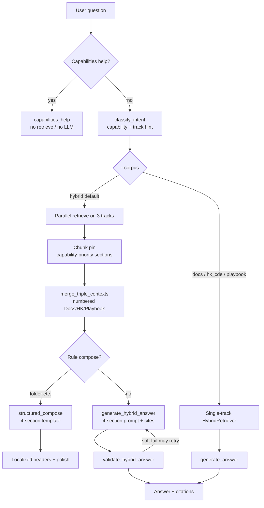

# HK BIM CDE Standard × ACC RAG

A local three-source RAG system that keeps **Hong Kong BIM / CDE standards**, an **ACC × HK implementation playbook**, and **Autodesk Docs product help** in separate indexes, then orchestrates single-track or hybrid answers by question intent.

The default answer shape (`--corpus hybrid`) is:

**Standards requirements → Project implementation → Product steps → Alignment & gaps**

## Demo

Watch a short walkthrough of the hybrid RAG in action:


https://github.com/user-attachments/assets/a55a3dec-eee8-4c38-9aef-855a1023afbc


If the player does not render in your GitHub client, open the file directly: [`assets/rag-demo.mp4`](assets/rag-demo.mp4).

## Three source RAGs

The three tracks are **physically isolated** (separate Chroma collections / chunk stores). Embeddings are never merged into one collection. Hybrid mode only combines retrieved chunks after retrieval, with numbered citations.

| Track | ID | What it covers | Corpus / index |
|-------|------|----------------|----------------|
| **1. Standards** | `hk_cde` | Hong Kong industry standards: CIC BIM Standards, CDE Beginner Guide, DEVB Harmonisation, BD ADM-19 / ADV-34, LandsD BIM-GIS, and related chapter Markdown plus Chinese alias routing | `knowledge/industry/hk_cde/` → `.rag_data/industry_hk_cde/` |
| **2. Playbook** | `playbook` | ACC × HK implementation handbook: four-container CDE, naming, permissions, approvals, design collaboration, information requirements, and ACC Project Template (GC / Buildings) guidance | `knowledge/playbook/acc_hk_bim/` → `.rag_data/playbook_acc_hk/` |
| **3. Product (Docs)** | `docs` | Autodesk Docs / ACC official help: folder organization, Naming Standard, permissions, Workflow, Project Template, and related product steps | crawled help → ingest → `.rag_data/` (docs main store) |

Each track also has its own **Query KB (route dictionary)**: maps colloquial / Chinese aliases to preferred sections or URLs for pinning and query rewriting **before** vector search. Route entries themselves **do not** enter the LLM prompt.

```text
Source knowledge (Markdown / help docs)
        │
        ├─ ingest + chunk + embed ──► Chroma (content store)
        └─ build_query_kb ──────────► Route KB (routing only)
```

## Orchestration architecture

Entry point: `ask.py` → `HybridOrchestrator` (`rag/orchestrator/pipeline.py`).



### 1. Intent and meta Q&A

- **Capabilities help** (e.g. “what can you do”): returns capability text only; `track=meta`; no retrieve, no Ollama.
- **`classify_intent`**: detects capability (`folder` / `naming` / `permissions` / `workflow` / `project_template` …) and track bias for hybrid query rewrite and section pinning.

### 2. Single-track vs hybrid

| `--corpus` | Behavior |
|------------|----------|
| `docs` / `hk_cde` / `playbook` | Retrieve only that content store + its Query KB |
| `hybrid` (default) | Parallel 3-track retrieve → merge → 4-section answer |
| `auto` | Pick track from classifier (product- vs standards-leaning) |

### 3. Hybrid merge and answer writing

1. **Parallel retrieval**: Docs / HK CDE / Playbook each run embedding + BM25 hybrid search.
2. **Capability pin**: e.g. naming pins HK federation/naming, Playbook CICBIMS structure, and Docs Naming Standard help pages so “concept overview” chunks do not dominate actionable chapters.
3. **`merge_triple_contexts`**: builds a shared numbered context list (`[1]`…) and records which track each chunk came from for later validation.
4. **Answer priority**:
   - Some capabilities (e.g. folder) use **`structured_compose`**: rule-based four sections to reduce empty “cannot confirm” answers from small models.
   - Otherwise **`generate_hybrid_answer`**: enforces the four-section structure; **Route KB never enters the prompt**.
5. **Validation**: missing-track citations, empty sections, or hard folder/naming constraints emit soft warnings and may retry generation.
6. **Language**: section headers follow the question language (EN → Standards Requirements / Implementation Guidance / Product Steps / Alignment & Gaps).

### Four-section answer contract

| Chinese | English | Primary source |
|---------|---------|----------------|
| 标准要求 | Standards Requirements | `hk_cde` |
| 实施建议 | Implementation Guidance | `playbook` |
| 产品操作 | Product Steps | `docs` |
| 对齐与缺口 | Alignment & Gaps | Combined (fits + product/process gaps) |

## Evaluation

Frozen baseline: [`eval/RESULTS.md`](eval/RESULTS.md).

On cross-domain (`expect_track: hybrid`) cases, forced single-track retrieval **cannot** cover more than one source family. Hybrid reaches **100% DualRecall / TripleRecall** in the latest run (6/6), while `docs` / `hk_cde` / `playbook` alone stay at **0%** multi-source coverage.

```bash
python scripts/run_eval_suite.py
# pieces:
python scripts/eval_query_kb.py
python scripts/eval_hk_cde.py
python scripts/eval_playbook_acc_hk.py
python scripts/eval_hybrid.py
python scripts/eval_hybrid_vs_single.py
```

## Quick start

### Dependencies

- Python 3.11+
- [Ollama](https://ollama.com/) for local generation + embedding (defaults in `rag/config.py`)
- Built indexes for all three tracks (or rebuild with the steps below)

```bash
cd /path/to/hk-bim-cde-standard-x-acc-rag
python -m venv .venv
source .venv/bin/activate
pip install -r requirements.txt

# Pull generation + embedding models
ollama pull qwen3.5:4b
ollama pull qwen3-embedding:0.6b
```

### Ask questions

```bash
python ask.py "How should Hong Kong CDE folders be set up?"
python ask.py "file naming standard"
python ask.py "what can you do"

# Retrieval only
python ask.py --no-generate "permissions on folders"

# Single track
python ask.py --corpus hk_cde "WIP Shared Published"
python ask.py --corpus docs "Organize Files"
python ask.py --corpus playbook "01_WIP discipline folders"
```

Full CLI reference: [COMMANDS.md](COMMANDS.md).

### Rebuild indexes (summary)

```bash
# Docs product store (requires help HTML / corpus first)
python ingest.py --rebuild
python scripts/build_query_kb.py

# Hong Kong standards store
python scripts/ingest_industry_hk_cde.py --rebuild
python scripts/build_industry_query_kb.py
python scripts/build_industry_kb_index.py --rebuild

# Playbook store
python scripts/ingest_playbook_acc_hk.py --rebuild
python scripts/build_playbook_query_kb.py
python scripts/build_playbook_kb_index.py --rebuild
```

PDF extraction and copyright notes: `knowledge/industry/hk_cde/README.md`. Official PDFs live under local `output/HK Standard/` (not committed by default).

## Repository layout

```text
ask.py / ingest.py     CLI entry points
rag/                   Retrieval, generation, track configs, orchestrator
knowledge/             Versioned Markdown corpora + query KBs
scripts/               Extract, ingest, eval, research scripts
eval/                  Evaluation cases
tests/                 Unit tests
output/                Crawl mirrors and official PDFs (local, gitignored)
.rag_data/             Chroma / chunks (local, gitignored)
```

## Design principles

1. **Three separate stores**: standards, playbook, and product help have different semantics; one shared collection pollutes retrieval.
2. **Hybrid synthesizes after retrieve**: each track retrieves independently; then number-merge + four-section writing.
3. **Route ≠ context**: Query KB / route indexes only select chapters and rewrite queries.
4. **Small-model friendly**: critical capabilities use structured compose / pinning to cut hallucination and empty answers.
5. **Traceable**: `[n]` citations map to the merged chunk list so each claim can be checked by track.

## License / copyright

- Code and self-authored playbook text may be used under this repository’s normal practice.
- CIC / DEVB / BD / LandsD / Autodesk materials remain copyright of their owners. This project keeps extracted Markdown for RAG; **do not push full official PDF packages to a public repository**.
