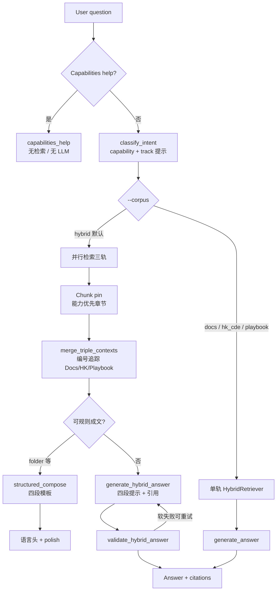

# HK BIM CDE Standard × ACC RAG

本地三源 RAG 系统：把 **香港 BIM / CDE 标准**、**ACC × 港标实施手册（Playbook）**、以及 **Autodesk Docs 产品帮助** 分库索引，再通过编排器按问题意图做单轨或混合问答。

回答默认面向「标准怎么要求 → 项目怎么落地 → 产品点哪里 → 对齐与缺口」四段结构（`--corpus hybrid`）。

## 三个 Source RAG

三轨 **物理隔离**（各自独立的 Chroma collection / chunks），**绝不混库 embedding**。Hybrid 只在检索后按引用合并进生成提示。

| Track | 代号 | 内容 | 语料 / 索引 |
|-------|------|------|-------------|
| **1. Standards** | `hk_cde` | 香港行业标准：CIC BIM Standards、CDE Beginner Guide、DEVB Harmonisation、BD ADM-19 / ADV-34、LandsD BIM-GIS 等（章节 Markdown + 中文别名路由） | `knowledge/industry/hk_cde/` → `.rag_data/industry_hk_cde/` |
| **2. Playbook** | `playbook` | ACC × 港标实施手册：四容器 CDE、命名、权限、审批、设计协同、信息要求、以及 ACC Project Template（GC / Buildings）落地建议 | `knowledge/playbook/acc_hk_bim/` → `.rag_data/playbook_acc_hk/` |
| **3. Product (Docs)** | `docs` | Autodesk Docs / ACC 官方帮助：文件夹组织、Naming Standard、权限、Workflow、Project Template 等操作步骤 | 爬虫产出 → ingest → `.rag_data/`（产品主库） |

每轨还有独立的 **Query KB（路由字典）**：把口语/中文别名映射到优先章节或 URL，在真正向量检索之前做 pin / 改写，**路由条目本身不进入 LLM 上下文**。

```text
知识源（Markdown / 帮助文档）
        │
        ├─ ingest + chunk + embed ──► Chroma（内容库）
        └─ build_query_kb ──────────► Route KB（仅路由）
```

## Orchestration 架构逻辑

入口：`ask.py` → `HybridOrchestrator`（`rag/orchestrator/pipeline.py`）。



### 1. 意图与元问答

- **Capabilities help**（例如「你可以做什么」）：直接返回能力说明，`track=meta`，不检索、不调用 Ollama。
- **`classify_intent`**：识别能力（`folder` / `naming` / `permissions` / `workflow` / `project_template` …）与偏轨提示，供 hybrid 改写检索 query、pin 章节。

### 2. 单轨 vs Hybrid

| `--corpus` | 行为 |
|------------|------|
| `docs` / `hk_cde` / `playbook` | 只检索对应内容库 + 该轨 Query KB |
| `hybrid`（默认） | 三轨并行检索 → 合并 → 四段成文 |
| `auto` | 按分类结果选轨（偏产品或偏标准） |

### 3. Hybrid 合并与成文

1. **并行检索**：Docs / HK CDE / Playbook 各跑 embedding + BM25 混合检索。
2. **Capability pin**：例如 naming 强制钉港标 federation/naming、Playbook CICBIMS 结构、Docs Naming Standard 帮助页，避免向量「概念回顾」压过操作章。
3. **`merge_triple_contexts`**：打成统一编号上下文（`[1]`…），并记录每条属于哪一轨；后续校验按轨检查覆盖。
4. **成文优先级**：
   - 部分能力（如 folder）走 **`structured_compose`**：规则四段，降低小模型「无法确认」空话。
   - 否则 **`generate_hybrid_answer`**：强制四段结构，且 **Route KB 不进 prompt**。
5. **校验**：缺轨引用、空段、Folder/Naming 硬约束失败时软警告并可重试生成。
6. **语言**：按问题语言本地化四段标题（EN → Standards Requirements / Implementation Guidance / Product Steps / Alignment & Gaps）。

### 四段回答契约

| 中文 | English | 应对应的源 |
|------|---------|------------|
| 标准要求 | Standards Requirements | `hk_cde` |
| 实施建议 | Implementation Guidance | `playbook` |
| 产品操作 | Product Steps | `docs` |
| 对齐与缺口 | Alignment & Gaps | 综合（对齐点 + 产品/流程缺口） |

## 快速开始

### 依赖

- Python 3.11+
- [Ollama](https://ollama.com/)：本地生成 + embedding（默认见 `rag/config.py`）
- 已构建的三轨索引（或按下方步骤重建）

```bash
cd /path/to/hk-bim-cde-standard-x-acc-rag
python -m venv .venv
source .venv/bin/activate
pip install -r requirements.txt

# 确保 ollama 已拉取生成与 embedding 模型
ollama pull qwen3.5:4b
ollama pull qwen3-embedding:0.6b
```

### 问答

```bash
python ask.py "香港 CDE 文件夹结构怎么配"
python ask.py "file naming standard"
python ask.py "你可以做什么"

# 只看检索、不生成
python ask.py --no-generate "permissions on folders"

# 指定单轨
python ask.py --corpus hk_cde "WIP Shared Published"
python ask.py --corpus docs "Organize Files"
python ask.py --corpus playbook "01_WIP 专业夹"
```

更全的 CLI 说明见 [COMMANDS.md](COMMANDS.md)。

### 重建索引（摘要）

```bash
# Docs 产品库（需先有帮助 HTML / 语料）
python ingest.py --rebuild
python scripts/build_query_kb.py

# 香港标准库
python scripts/ingest_industry_hk_cde.py --rebuild
python scripts/build_industry_query_kb.py
python scripts/build_industry_kb_index.py --rebuild

# Playbook
python scripts/ingest_playbook_acc_hk.py --rebuild
python scripts/build_playbook_query_kb.py
python scripts/build_playbook_kb_index.py --rebuild
```

PDF 抽取与版权说明见 `knowledge/industry/hk_cde/README.md`。官方 PDF 原文放在本地 `output/HK Standard/`（默认不入库 Git）。

## 仓库结构

```text
ask.py / ingest.py     CLI 入口
rag/                   检索、生成、三轨配置、orchestrator
knowledge/             可版本管理的 Markdown 语料 + query KB
scripts/               抽取、ingest、eval、研究脚本
eval/                  评测用例
tests/                 单元测试
output/                爬虫与 PDF 原文（本地，.gitignore）
.rag_data/             Chroma / chunks（本地，.gitignore）
```

## 设计原则

1. **三源分库**：标准、手册、产品帮助语义不同，合并 collection 会污染检索。
2. **Hybrid 后置合成**：先各管各的 retrieval，再编号合并 + 四段写作。
3. **Route ≠ Context**：Query KB / 路由索引只用于选章与改写 query。
4. **小模型友好**：关键能力用 structured compose / pin，减少幻觉与空话。
5. **可追溯**：答案中的 `[n]` 对应合并后的 chunk 列表，便于核对来源轨。

## License / 版权注意

- 代码与自撰 Playbook 语料可按本仓库惯例使用。
- CIC / DEVB / BD / LandsD / Autodesk 文档版权归原作者。本项目仅保留抽取后的 Markdown 供 RAG；**请勿把官方 PDF 全文包推送到公共仓库**。
